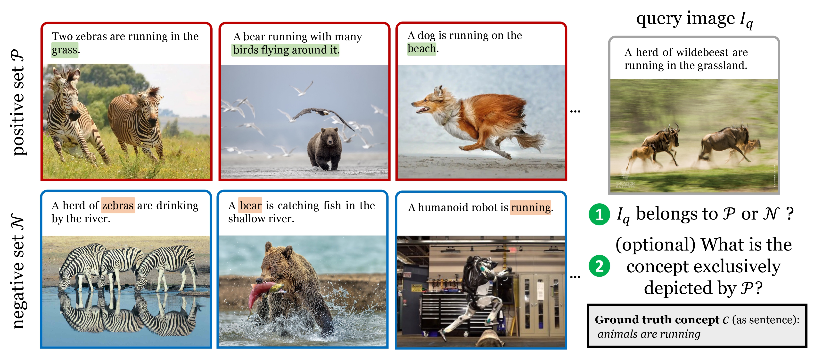
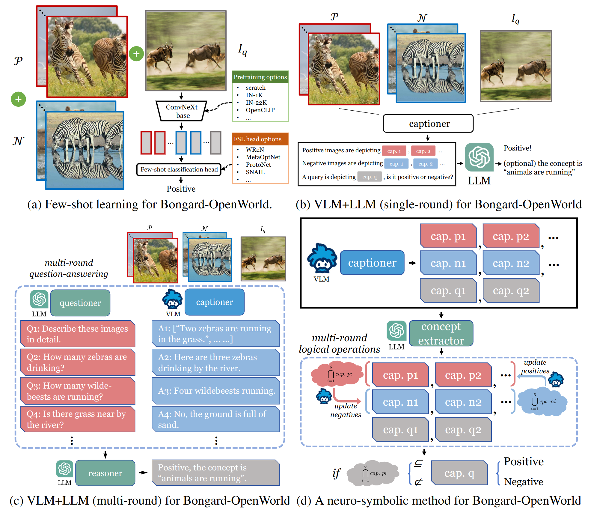

Bongard-OpenWorld
===
<p align="center"></p>

This repository hosts the code for our paper:

[Bongard-OpenWorld: Few-Shot Reasoning for Free-form Visual Concepts in the Real World](https://arxiv.org/pdf/2310.10207.pdf)

by [Rujie Wu*](https://joyjayng.github.io/), [Xiaojian Ma*](https://jeasinema.github.io/), [Qing Li](https://liqing-ustc.github.io/), [Wei Wang](https://cognn.com/), [Zhenliang Zhang](https://www.zlz.link/), [Song-Chun Zhu](https://zhusongchun.net/), [Yizhou Wang](https://cfcs.pku.edu.cn/english/people/faculty/yizhouwang/index.htm)

[🔥 Leaderboard and submission guide!](assets/benchmarking_leaderboard.md) | [arXiv](https://arxiv.org/abs/2310.10207) | [Paper](https://arxiv.org/pdf/2310.10207.pdf) | [Project page](https://joyjayng.github.io/Bongard-OpenWorld.github.io/) | [Dataset](https://huggingface.co/datasets/joyjay/Bongard-OpenWorld)

## News
- 10/20/2023: 🎉🎉 [Leaderboard](https://paperswithcode.com/sota/visual-reasoning-on-bongard-openworld) has been launched.
- 10/20/2023: 🎉🎉 [Code](https://github.com/joyjayng/Bongard-OpenWorld) and [Dataset](https://huggingface.co/datasets/joyjay/Bongard-OpenWorld) have been released.
- 10/18/2023: 🎉🎉 Official [Project Page](https://joyjayng.github.io/Bongard-OpenWorld.github.io/) has been launched.
- 10/16/2023: 🎉🎉 [ArXiv](https://arxiv.org/abs/2310.10207) preprint has been submitted.

## Abstract
We introduce **Bongard-OpenWorld**, a new benchmark for evaluating real-world few-shot reasoning for machine vision. It originates from the classical *Bongard Problems (BPs)* : Given two sets of images (positive and negative), the model needs to identify the set that query images belong to by inducing the visual concepts, which is exclusively depicted by images from the positive set. Our benchmark inherits the few-shot concept induction of the original BPs while adding the two novel layers of challenge: 1) open-world free-form concepts, as the visual concepts in Bongard-OpenWorld are unique compositions of terms from an open vocabulary, ranging from object categories to abstract visual attributes and commonsense factual knowledge; 2) real-world images, as opposed to the synthetic diagrams used by many counterparts. In our exploration, Bongard-OpenWorld already imposes a significant challenge to current few-shot reasoning algorithms. We further investigate to which extent the recently introduced Large Language Models (LLMs) and Vision-Language Models (VLMs) can solve our task, by directly probing VLMs, and combining VLMs and LLMs in an interactive reasoning scheme. We even designed a neuro-symbolic reasoning approach that reconciles LLMs & VLMs with logical reasoning to emulate the human problem-solving process for Bongard Problems. However, none of these approaches manage to close the human-machine gap, as the best learner achieves 64% accuracy while human participants easily reach 91%. We hope Bongard-OpenWorld can help us better understand the limitations of current visual intelligence and facilitate future research on visual agents with stronger few-shot visual reasoning capabilities.

## Approaches
<p align="center"></p>

We explore four families of approaches: (a) casting Bongard-OpenWorld into a standard ''2-way, 6-shot'' few-shot learning problem and tackling it using state-of-the-art few-shot learners with pretrained image representations; (b) Combining an LLM (reasoner) and a VLM (image captioner) in a single round fashion, where the VLM simply caption each Bongard image and send their captions to LLM for solving this problem; (c) extending the method in (b) to multiple rounds, where the LLM will also iteratively prob the VLM for more image details, resulting in more condense information for solving Bongard; (d) A neuro-symbolic approach, where a VLM generates the initial captions, then an LLM extracts visual concepts from them. These concepts are subsequently updated through logical operations, leveraging the responses provided by VLM, until the problem is solved.

## Main Results
All the non-LLM models use a ConvNeXt-base image encoder, and we experiment with different pretraining strategies: no pretraining at all (scratch), pretraining with ImageNet-1K labels (IN-1K), pretraining with full ImageNet-22K labels (IN-22k) and pretraining with LAION-2B dataset (OpenCLIP). While the LLM-based models use either BLIP-x or ChatCaptioner captions as the image representations. For the auxiliary captioning task, the model is connected to the caption decoder of a pretrained *BLIP-2-opt-6.7B* model. *$denotes common_sense. **$involves utilizing the ground truth concepts from Bongard-OpenWorld training set and the captions from BLIP-2 as inputs to fine-tuning ChatGPT over 5 epochs. The fine-tuned model is evaluated on the test set. It is worth noting that InstructBLIP was not fine-tuned due to a significant drop in its performance on ChatGPT.

| method | image representation | aux. task? | short concept | long concept | CS* concept | non-CS* concept | avg. |
| :---: | :---: | :---: | :---: | :---: | :---: | :---: | :---: |
| SNAIL | scratch | ✗ | 52.8 | 46.2 | 50.9 | 49.3 | 49.8 |
| SNAIL | IN-1K | ✗ | 61.5 | 54.9 | 48.2 | 62.4 | 58.5 |
| SNAIL | IN-22K | ✗ | 62.8 | 57.7 | 54.5 | 62.8 | 60.5 |
| SNAIL | OpenCLIP | &#10007; | 64.2 | 57.7 | 57.3 | 62.8 | 61.3 |
| SNAIL | OpenCLIP | &#10004; | 66.1 | **61.5** | **63.6** | 64.1 | **64.0** |
| OpenFlamingo | OpenCLIP | N/A | 50.0 | 48.4 | 50.9 | 48.6 | 49.3 |
| Otter | OpenCLIP | N/A | 49.3 | 49.3 | 48.9 | 49.4 | 49.3 |
| ChatGPT | BLIP-2 | N/A | 60.6 | 56.6 | 55.5 | 60.0 | 58.8 |
| ChatGPT | InstructBLIP | N/A | 52.1 | 50.6 | 48.1 | 52.7 | 51.4 |
| ChatGPT | ChatCaptioner | N/A | 52.3 | 45.6 |57.3 | 46.2 | 49.3 |
| ChatGPT (Fine-tuned)** | BLIP-2 | N/A | 67.0 | 58.8 | 55.5 | **66.2** | 63.3 |
|GPT-4 | BLIP-2 | N/A | 64.5 | 58.0 | 57.3 | 63.2 | 61.6 |
| GPT-4 | InstructBLIP | N/A | **67.3** | 59.7 | 59.3 | 65.6 | 63.8 |
| Neuro-Symbolic | InstructBLIP | N/A | 58.3 | 52.2 | 56.4 | 55.2 | 55.5 |
| <span style="color: gray;">Human</span> | <span style="color: gray;">N/A</span> | <span style="color: gray;">N/A</span> | <span style="color: gray;">**91.7**</span> | <span style="color: gray;">**90.1**</span> | <span style="color: gray;">**89.1**</span> | <span style="color: gray;">**91.7**</span> | <span style="color: gray;">**91.0**</span> |

## Installation
This codebase can be built from scratch on Ubuntu 20.04 with Python 3.10, PyTorch 1.13 and CUDA 11.7.

```bash
conda create -n bongard-ow python=3.10
conda activate bongard-ow
conda install pytorch=1.13 torchvision torchaudio pytorch-cuda=11.7 -c pytorch -c nvidia
pip install -r requirements.txt
```

##  Data Preparation
To download all images from the URLs, navigate to the root directory of Bongard-OpenWorld and run `scripts/crawl_images.py`.

```bash
cd Bongard-OpenWorld
python scripts/crawl_images.py
```

Please note that some links may be invalid due to the instability of the URLs. To ensure that the community can reproduce our results from scratch, we have provided a backup of all the images. You can download from [Google Drive](https://drive.google.com/file/d/1aXr3ihVq0mtzbl6ZNJMogYEyEY-WALNr/view?usp=sharing).

The images should be extracted to `assets/data/bongard-ow/images` and the file structure looks like:
```plain
assets
├── data
│   └── bongard-ow
│       ├── images
│       │   ├── 0000
│       │   ├── 0001
│       │   ├── ....
│       │   └── 1009
│       ├── bbox_data.pkl
│       ├── bongard_ow.json
│       ├── bongard_ow_train.json
│       ├── bongard_ow_val.json
│       └── bongard_ow_test.json
└── weights
```

Please note that this repository only hosts the code for Bongard-OpenWorld. All images of Bongard-OpenWorld are crawled from [Google Images](https://images.google.com) and should not be considered part of the source code.

We do not claim ownership of any image in Bongard-OpenWorld. Therefore, we strongly recommend that you delete all images immediately after benchmarking all approaches and evaluations.

## Traning Few-Shot Models
```bash
bash fewshot_learning.sh
```

## Inference VLM + LLM
### single-round
```bash
bash vlm+llm_single_round.sh
```
### multi-round
```bash
bash vlm+llm_multi_round.sh
```
Thanks for the codebase of [ChatCaptioner](https://github.com/Vision-CAIR/ChatCaptioner).
### neuro-symbolic
```bash
bash neuro-symbolic.sh
```

## Inference end-to-end pretrained VLM
```bash
bash vlm.sh
```
Thanks for the codebase of [OpenFlamingo](https://github.com/mlfoundations/open_flamingo) and [Otter](https://github.com/Luodian/Otter).

## License
- Code: [Apache](LICENSE)
- Data: [CC BY-NC-SA 4.0](https://creativecommons.org/licenses/by-nc-sa/4.0/deed.en)

## Citation
If you find Bongard-OpenWorld helpful for your research, please consider citing our paper.
```bibtex
@misc{wu2023bongardopenworld,
      title={Bongard-OpenWorld: Few-Shot Reasoning for Free-form Visual Concepts in the Real World}, 
      author={Rujie Wu and Xiaojian Ma and Qing Li and Wei Wang and Zhenliang Zhang and Song-Chun Zhu and Yizhou Wang},
      year={2023},
      eprint={2310.10207},
      archivePrefix={arXiv},
      primaryClass={cs.LG}
}
```