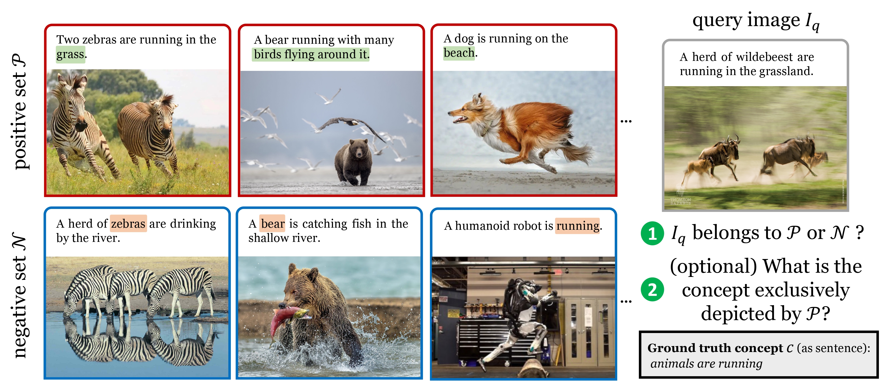

Bongard-OpenWorld Benchmarking and Leaderboard
===

This hosts the benchmarking instructions and [leaderboard](https://paperswithcode.com/sota/visual-reasoning-on-bongard-openworld) of Bongard-OpenWorld.

## Guide

Please send your result to [Rujie Wu](joyjayng@gmail.com) with the following information:

1. The **name** of your model (or team).

2. **Result.** Metrics can be found in our [paper](https://arxiv.org/pdf/2310.10207.pdf).

## Leaderboard -- Classification
| Rank | Model | 2-Class Accuracy | short concept | long concept | CS* concept | non-CS* concept |
| :---: | :---: | :---: | :---: | :---: | :---: | :---: |
| 1 | Human | 91.0 | 91.7 | 90.1 | 89.1 | 91.7 |
| 2 | SNAIL | 64.0 | 66.1 | 61.5 | 63.6 | 64.1|
| 3 | InstructBLIP + GPT-4 | 63.8 | 67.3 | 59.7 | 59.3 | 65.6 |
| 4 | BLIP-2 + ChatGPT (Fine-tuned) | 63.3 | 67.0 | 58.8 | 55.5 | 66.2 |
| 5 | InstructBLIP + ChatGPT + Neuro-Symbolic | 55.5 | 58.3 | 52.2 | 56.4 | 55.2 |
| 6 | ChatCaptioner + ChatGPT | 49.3 | 52.3 | 45.6 | 57.3 | 46.2 |
| 7 | Otter | 49.3 | 49.3 | 49.3 | 48.9 | 49.4 |

## Leaderboard -- Concepts Induction
| Rank | Model | image representation | BLEU1 | BLEU2 | BLEU3 | BLEU4 | METEOR | ROUGE*L* | CIDEr |
| :---: | :---: | :---: | :---: | :---: | :---: | :---: | :---: | :---: | :---: |
| 1 | ChatGPT | BLIP-2 w/ Fine-tuning | 0.441 | 0.292 | 0.209 | 0.153 | 0.222 | 0.417 | 1.714 |
| 2 | GPT-4 | BLIP-2 | 0.310 | 0.199 | 0.140 | 0.100 | 0.207 | 0.358 | 1.351 |
| 3 | ChatGPT | BLIP-2 | 0.186 | 0.109 | 0.070 | 0.045 | 0.154 | 0.258 | 0.781 |